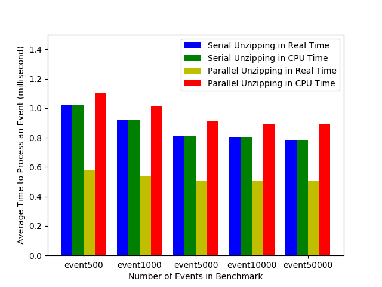
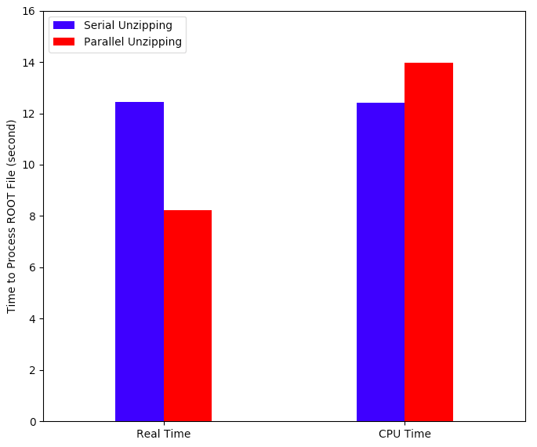

Title: Fast ROOT IO
Date: 2016-12-20 14:05
Slug: project_fast_root_io.html
Authors: Brian Bockelman
Summary: Fast ROOT IO Project

This project aims to improve the use of ROOT IO for HEP analysis users; primarily, we aim for mechanisms
that will speed up ROOT IO for these use cases.

### Implicit Multithreading

In ROOT 6.08, the ROOT team introduced the concept of Implicit Multi Threaded (IMT) mode.  When this is enabled,
the ROOT libraries will utilize multiple threads to for reading data.

This mode does _not_ change the APIs or allow the user to invoke the ROOT libraries from multiple threads in general
(hence the name _implicit_ multithreading).

We are working to expand the IMT mode to cover a large fraction of the ROOT IO API. We implemented parallel unzipping with Intel Thread Building Block(TBB) and this feature can be enabled with IMT mode. We tested performance of parallel unzipping with both synthetic ROOT file and real HEP ROOT file. Our experiements were conducted on a desktop-class machine with 4-core Intel(R) Core(TM) i5-3330 CPU @ 3.00GHz without hyperthreading and OS was Ubuntu 14.04.

In Figure 1, we test decompression speed on synthetic event benchmarks. We create ROOT files with 500 - 50,000 events. The performance is measured by sequentially reading all events. The figure shows the average runtime per event.

  
   <b>Figure 1. Performance between Serial and Parallel Unzipping on Event Benchmark</b> 

As background threads can decompress data prior to the main thread accessing it, As shown in Figure 1, parallel unzipping improves read performance with more noticeable improvements at higher event counts. Parallel unzipping takes 52% - 58% processing time of serial unzipping. These synchronization techniques  require CPU cycles; this technique takes 8% - 13% more CPU cycles.

We also test parallel unzipping on a ROOT file from HEP public data (B2HHH.root compressed with zlib at compression level 6) which contains 25 branches and 8,556,118 entries. Figure 2 illustrates the performance improvement. Parallel unzipping takes 66% of serial unzipping in real time at the cost of 12% increase in CPU time.

  
   <b>Figure 2. Performance between Serial and Parallel Unzipping on B2HHH.root </b> 

### Bulk API

The ROOT IO API is relatively heavyweight: types are determined at runtime and some APIs can result in a deep nest of virtual calls.
Further, ROOT must be invoked once per event, meaning this overhead happens for every event, _regardless_ of the complexity.

We are working on a new "bulk API" that allows many objects to be deserialized per call to ROOT, amortizing the overhead of the
ROOT IO API.

We view this as the first step toward implementing zero-copy IO: if the overhead of reading data is too high, the cost of the memory
copy is too small to be noticed.

### Compression Algorithms

By default, ROOT aggressively compresses its files utilizing a "best-of-breed" compression algorithm, `zlib`.  While a good choice
for a wide variety of use cases, we have been exploring various ways to improve the performance of the compression:

- *Alternate algorithms*: Some compression algorithms are tailored for decompression speed at the cost of compression speed or ratio;
  we are investigating whether ROOT should add support for these algorithms for cases where a file is read many times.
- *Random access*: Multiple events may get compressed together, meaning we must decompress many events to read a single one.  We
  are working to drop "restart markers" to allow true random access to individual events.
- *Faster =zlib=*: Various companies have developed significant patchsets to =zlib= to utilize modern CPU features for significant
  speedups.  These are not in wide use as the patches will cause crashes on older CPU models.  We are working to develop patches
  that work well across all CPU types.

### TTreeProcessor

A majority of ROOT-based analyses have a high level of parallelism: each event analyzed is independent of all others.  However,
the analysis itself is impelmented with a `for`-loop: the serializes the work.

The `TTreeProcessor` is an attempt to provide functional-like constructs to the traditional ROOT analysis.  The user provides the
"contents" of the for-loop, while the processor framework implements the parallelism.

Unlike successful prior projects like PROOF or PROOF-lite, the TTreeProcessor aims to expose modern C++11 interfaces that the
compiler can aggressively inline.  When combined with the bulk API, we believe this will eliminate expensive function calls in
the "hot path" of the analysis.

