Title: Microbenchmarking and performance unit testing for ROOT
Date: 2017-07-28 12:00
Slug: project_microbenchmarking.html
Authors: Oksana Shadura
Under supervision of Dr. Brian Bockelman and Dr. Vassil Vassilev
Summary: ROOT Vectorization and IO Benchmarking

### Performance unit testing (Google Benchmark)

Google Benchmark is a library to support the benchmarking of functions, similar to unit-tests. As main functionality, Google  benchmark provide a micro benchmark framework with possibility to change arguments and ranges, to use templated benchmarks, providing reports in csv and json output formats and using multithreading support.

### Vectorization benchmarks

After significant efforts of ROOT rteam in ROOT code modernization, in particulary, in vectorization of ROOT, we tried to benchmark available functionality for GenVector and Math libraries.

On Figure 1, shown results of Google micro-benchmarking of different "hot" functions that are used frequently for HEP purposes.
It is showing differences in GCC and ICC compiler efficiency in vectorization of functions from GenVector library.

  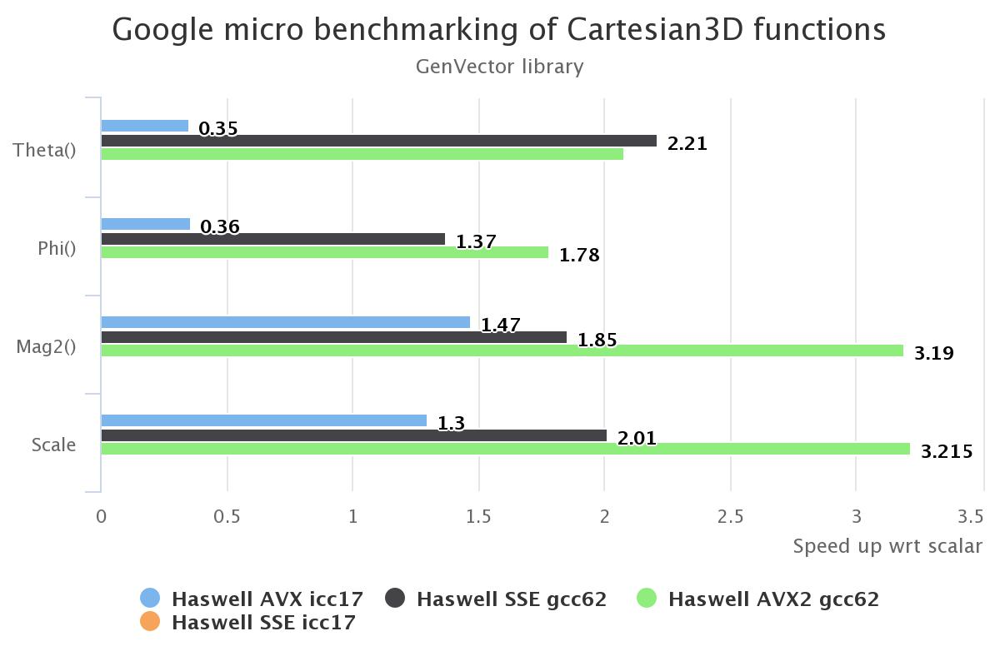
   <b>Figure 1. Microbenchmarking of Cartesian3D benchmarks</b> 

On Figure 2, shown results of Google micro-benchmarking of one of the syntetic benchmarks provided by LHCb which is whery close to real case usage in experiment for RICH mirror system.
It is showing differences in GCC and ICC compiler efficiency in vectorization of functions from GenVector library.

  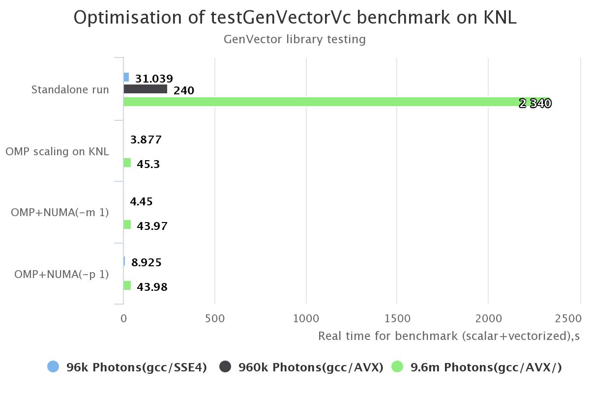
   <b>Figure 2. Microbenchmarking of GenVectorVc benchmark in KNL (gcc6.2)</b> 

  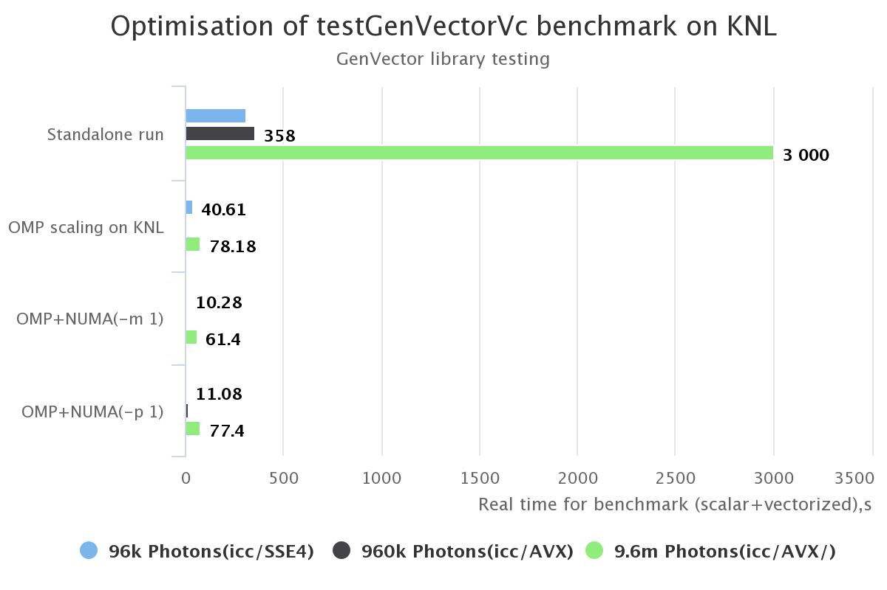
   <b>Figure 3. Microbenchmarking of GenVectorVc benchmark in KNL (ICC17)</b> 

During our research we tryied to scale simple GenvectorVc benchmark efficiently for KNL architecture.
We tried to fill all KNL cores by parallelization of  data intensive loops via OpenMP.

  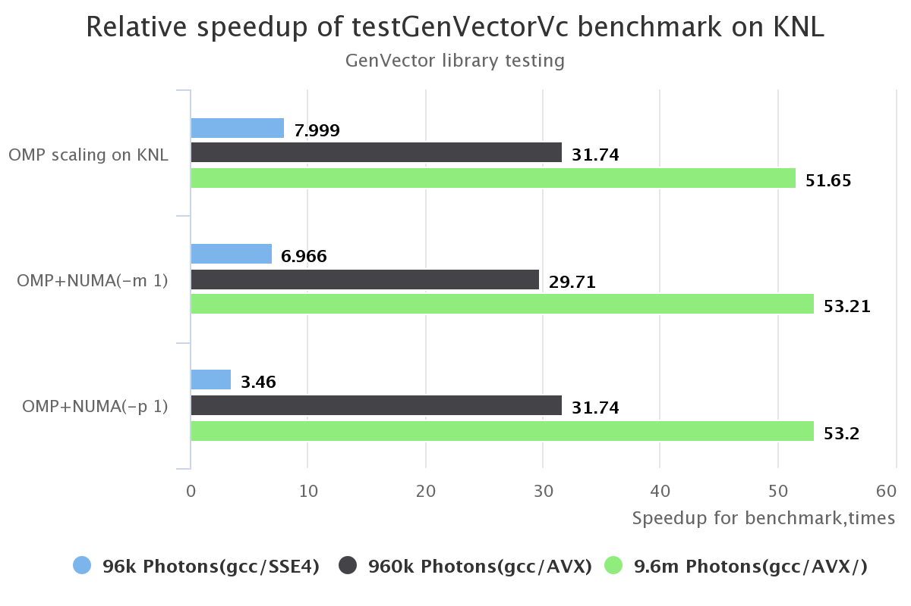
   <b>Figure 4. Speedup of GenVectorVc benchmark in KNL (gcc6.2)</b> 

  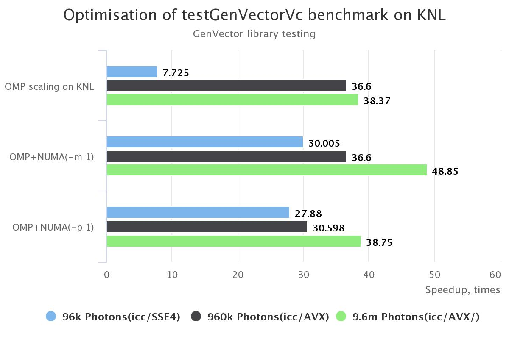
   <b>Figure 5. Speedup of GenVectorVc benchmark in KNL (ICC17)</b> 

If we check roofline analysis from Intel vectorization Advisor, how GenVector benchmark is utilizing latest Haswell architecture,
we can notice that most red hotspots on Figures 7 and 8 are due unefficciensy of scalar version of code (GCC hospots is displayed on Figure 6). ICC by itself was capable to properly optimize code for better performance vs arithmetic intencity of GenVector test functions.

  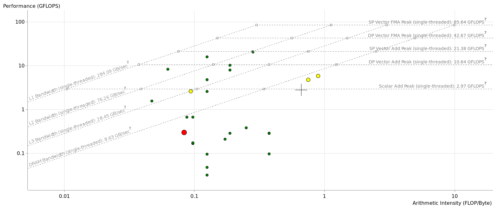
   <b>Figure 6. Roofline plots for testGenVectorVc on latest Haswell (GCC build)</b> 

  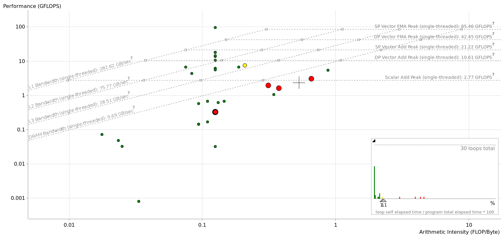
   <b>Figure 7. Roofline plots for testGenVectorVc on latest Haswell (ICC build)</b> 

  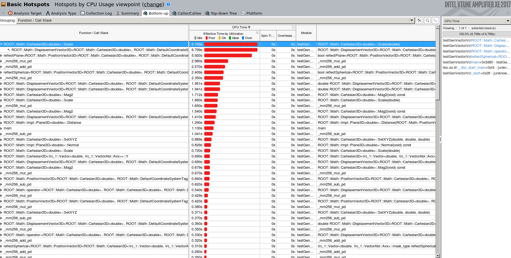
   <b>Figure 8. Microbenchmarking IO depending of size of AutoFlush for TBufferMerger(TFile) on KNL - file with 1 branch</b> 

### IO benchmarks

During testing we were trying to evaluate scalability of new TBufferMerger implementation that facilitae writing data in parallel from multiple threads in single file on KNl.
We tested with TMemFiles and TFiles, which were saved on RAM disks allocated for tests on KNL. 

  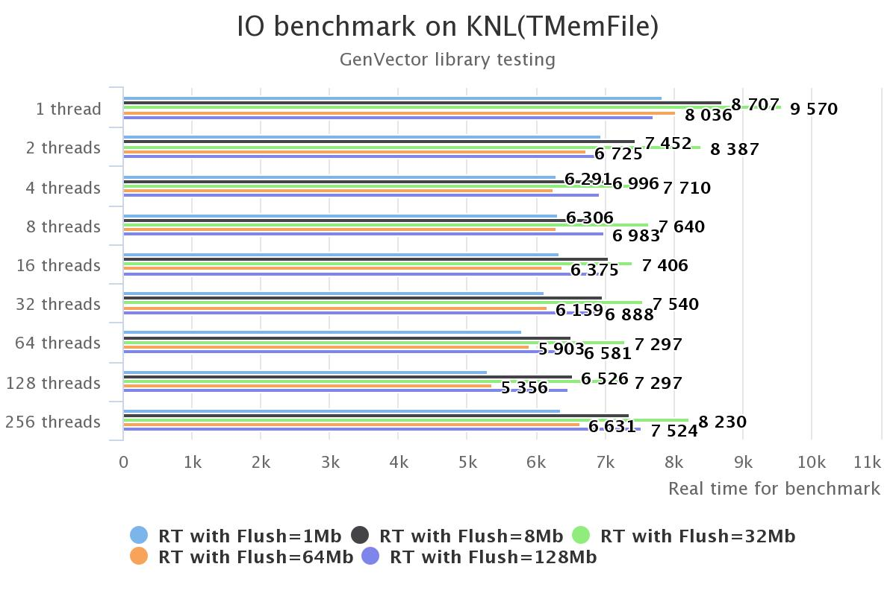
   <b>Figure 9. Microbenchmarking IO depending of size of AutoFlush for TBufferMerger(TMemFile) on KNL</b> 

  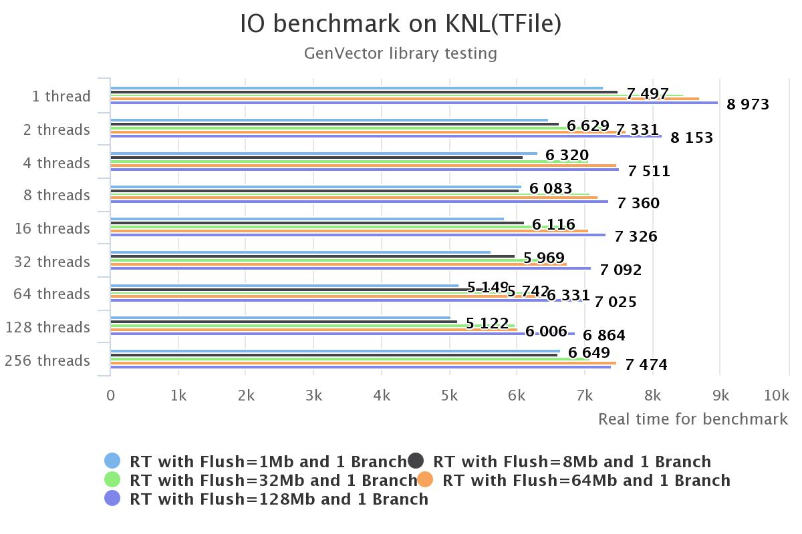
   <b>Figure 10. Microbenchmarking IO depending of size of AutoFlush for TBufferMerger(TFile) on KNL - file with 1 branch</b> 

FIXME: More result to be shown later with different number of branches and different size of cluster. 

### RooFit benchmarks

RooFit example proposed by Vincent A. Croft to be benchmark is stressing out fact how is parallelization could useful in RooFit.
RooFit currently has a simple parallel evaluation engine for likelihood objects.

  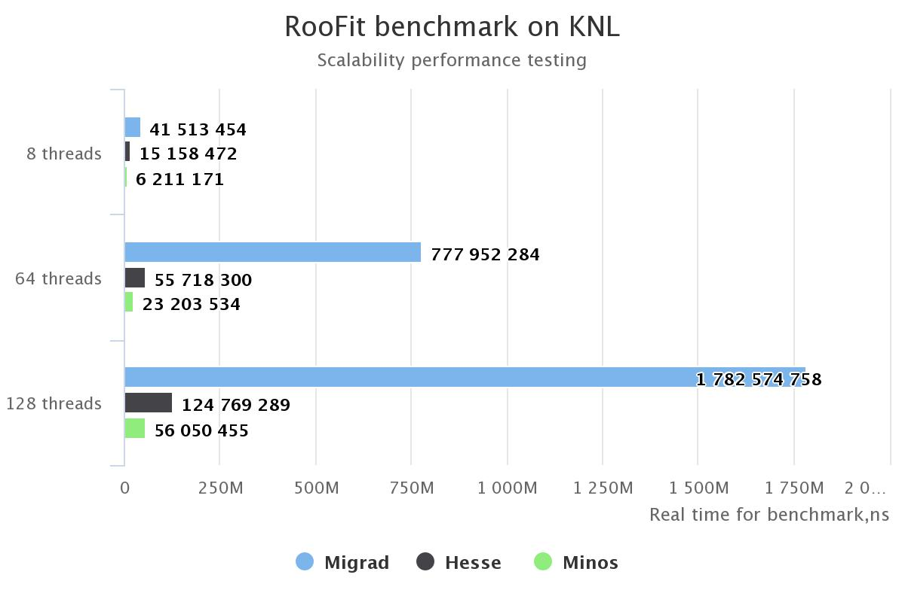
   <b>Figure 11. Microbenchmarking RooFit minimizer depending of type of minimizer (Migrad, Hesse and Minos) and number of threads on KNL </b> 

FIXME: we couldn't run with 256 threads, because of exception with allocation of pages from OS.
This benchmark shows that in current RooFit implementation there is a bottleneck in scalability caused by reason that too many files are opened in pipe "RooFit::BidirMMapPipe_impl::BidirMMapPipeException"
