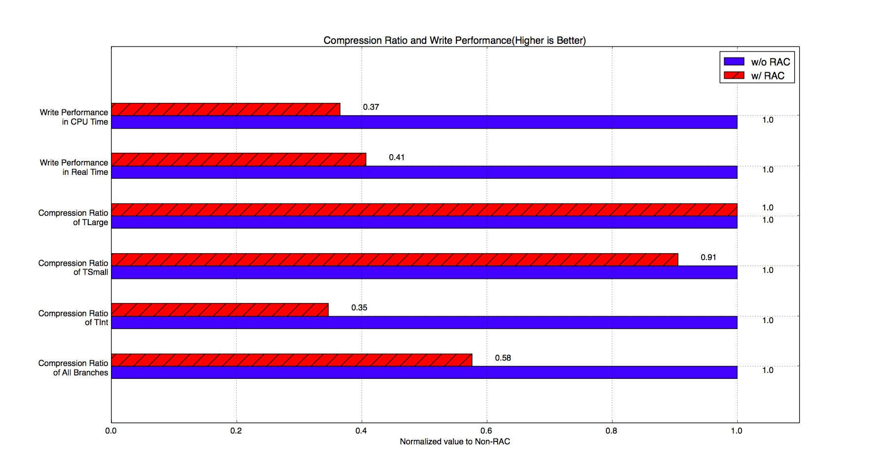
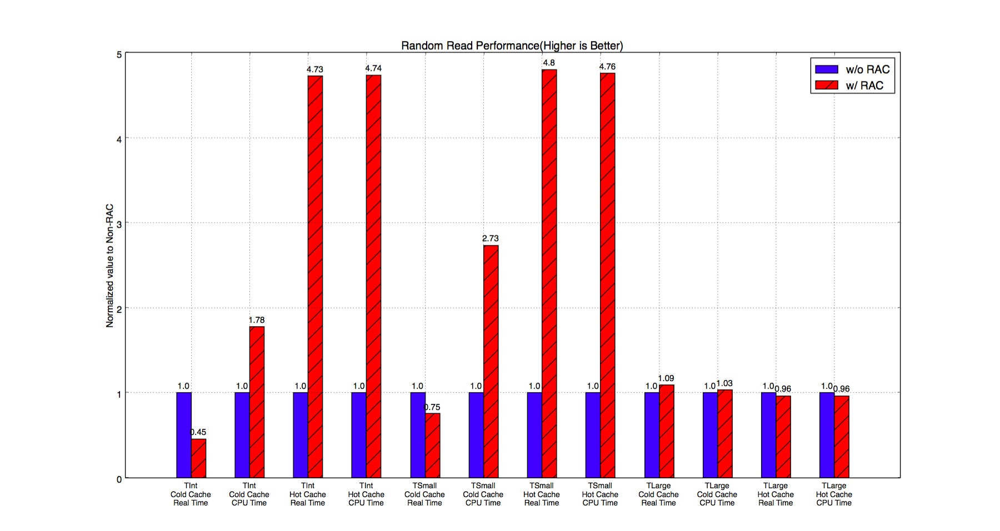
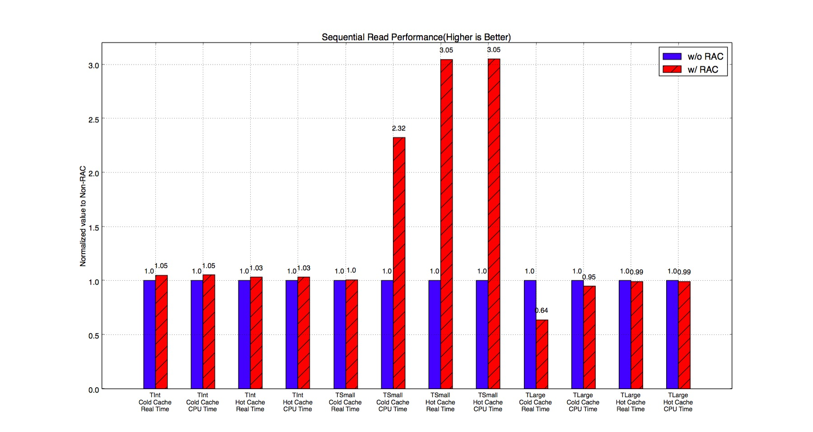
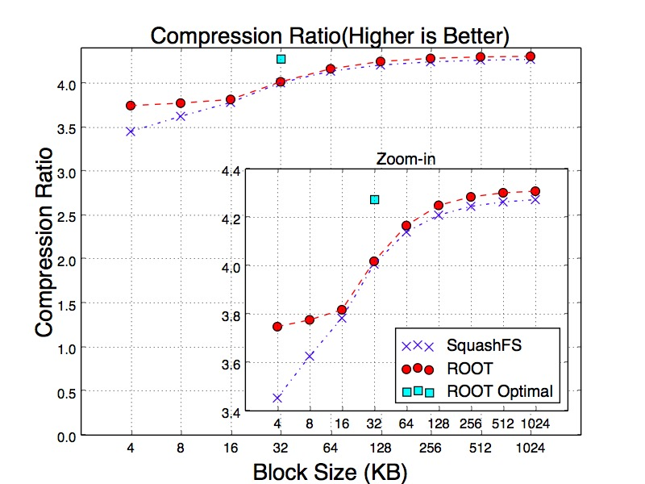
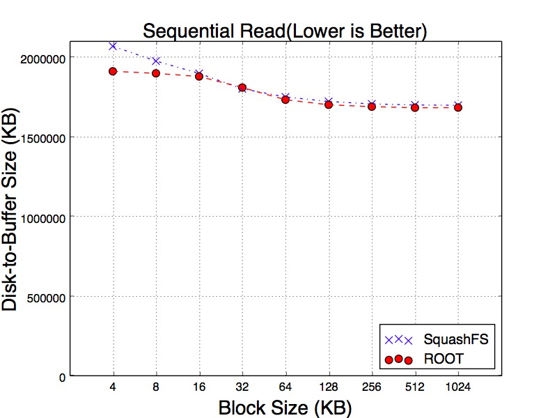
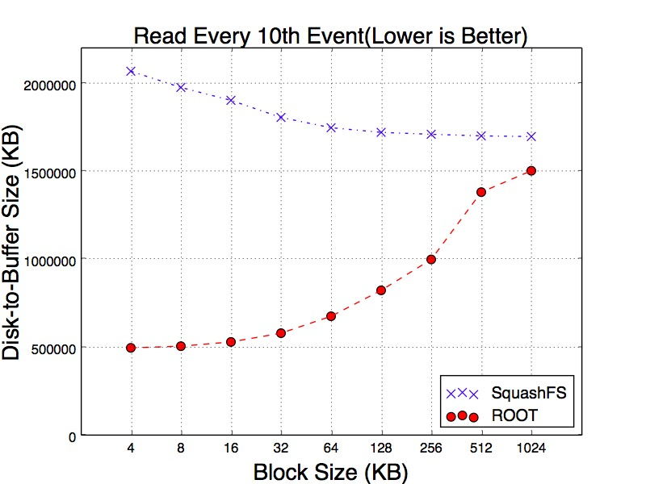
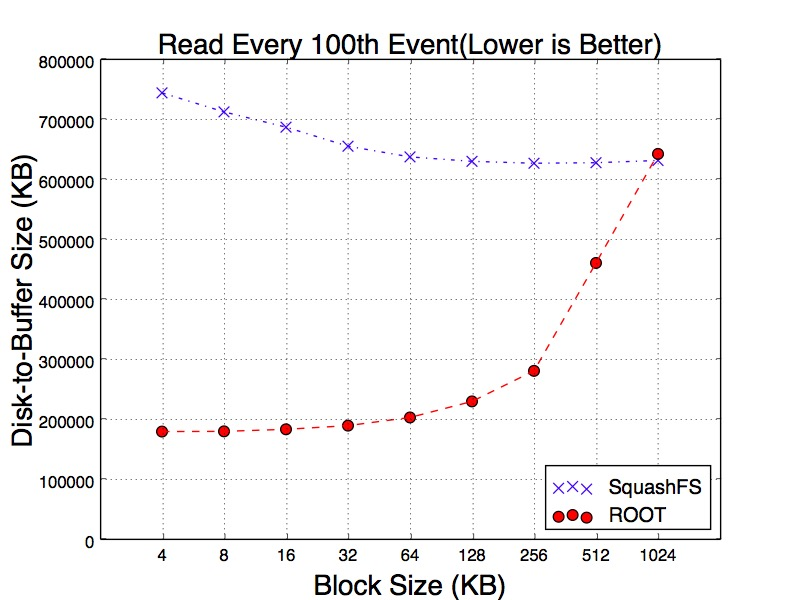
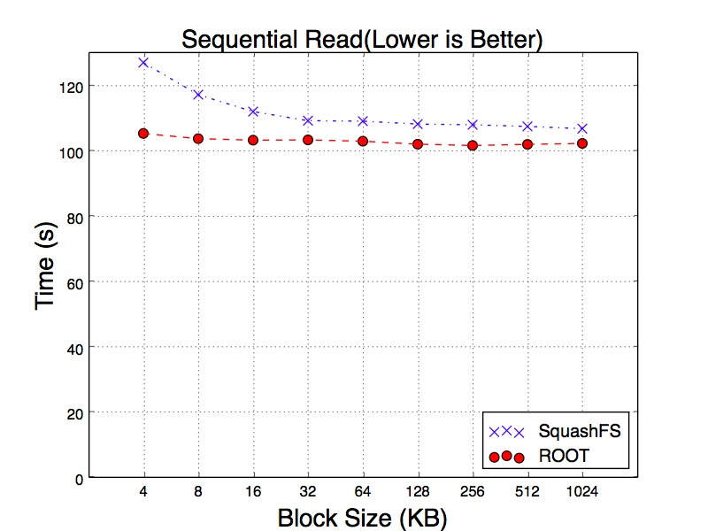
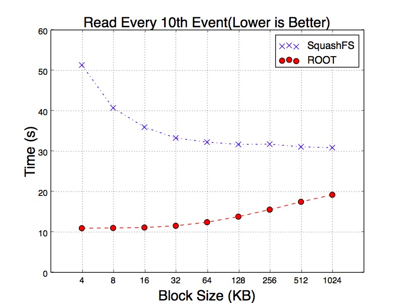
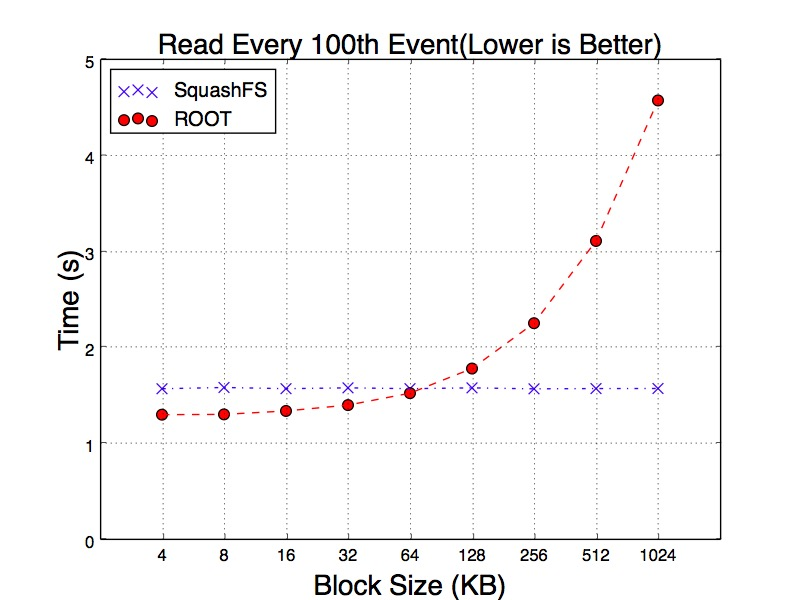

Title: Exploring Compression Techniques of ROOT IO
Date: 2017-03-22 10:00
Slug: project_root_io_compression.html
Authors: Zhe Zhang
Summary: ROOT IO Compression Project

ROOT provides an flexible format used throughout the HEP community. The number of use cases - from an archival data format to end-stage analysis - has required a number of tradeoffs to be exposed to the user. For example, a high compression level in the traditional DEFLATE algorithm will result in a smaller file (saving disk space) at the cost of slower decompression (costing CPU time when read). At the scale of the LHC experiment, poor design choices can result in terabytes of wasted space or wasted CPU time. We explore and attempt to quantify some of these tradeoffs.
Specifically, we explore: 

1. The use of alternate compressing algorithms to optimize for read performance;
2. An alternate method of compression individual events to allow efficient random access;
3. A new approach to whole-file compression. 

### ZLIB vs. LZMA vs. LZ4

The following table compares various metrics among ZLIB, LZMA and LZ4 libraries. As seen in the table, LZ4 decompression speeds are of 10 to 100 magnitudes faster than ZLIB and LZMA. LZMA, on the other hand, provides high compression ratios and shows a strong candidancy for archival applications.

<table class="tg" align="center">
  <tr>
    <th class="tg-hgcj">Algorithms</th>
    <th class="tg-amwm">Compression Time (s)</th>
    <th class="tg-amwm">Decompression Time (s)</th>
    <th class="tg-amwm">Compressed File Size (GB)</th>
    <th class="tg-amwm">Compression Ratio</th>
  </tr>
  <tr>
    <td class="tg-baqh">ROOT(ZLIB-6)</td>
    <td class="tg-baqh">228.67</td>
    <td class="tg-baqh">18.45</td>
    <td class="tg-baqh">1.54</td>
    <td class="tg-baqh">4.14</td>
  </tr>
  <tr>
    <td class="tg-baqh">ZLIB-1</td>
    <td class="tg-baqh">86.47</td>
    <td class="tg-baqh">21.51</td>
    <td class="tg-baqh">1.79</td>
    <td class="tg-baqh">3.58</td>
  </tr>
  <tr>
    <td class="tg-baqh">ZLIB-5</td>
    <td class="tg-baqh">159.84</td>
    <td class="tg-baqh">19.20</td>
    <td class="tg-baqh">1.58</td>
    <td class="tg-baqh">4.03</td>
  </tr>
  <tr>
    <td class="tg-baqh">ZLIB-9</td>
    <td class="tg-baqh">1715.25</td>
    <td class="tg-baqh">18.28</td>
    <td class="tg-baqh">1.49</td>
    <td class="tg-baqh">4.27</td>
  </tr>
  <tr>
    <td class="tg-baqh">LZ4</td>
    <td class="tg-baqh">11.26</td>
    <td class="tg-baqh">2.97</td>
    <td class="tg-baqh">2.17</td>
    <td class="tg-baqh">2.94</td>
  </tr>
  <tr>
    <td class="tg-baqh">LZ4HC-5</td>
    <td class="tg-baqh">95.13</td>
    <td class="tg-baqh">2.81</td>
    <td class="tg-baqh">1.75</td>
    <td class="tg-baqh">3.76</td>
  </tr>
  <tr>
    <td class="tg-baqh">LZ4HC-9</td>
    <td class="tg-baqh">275.31</td>
    <td class="tg-baqh">2.54</td>
    <td class="tg-baqh">1.66</td>
    <td class="tg-baqh">3.85</td>
  </tr>
  <tr>
    <td class="tg-baqh">LZMA-1</td>
    <td class="tg-baqh">823.84</td>
    <td class="tg-baqh">230.64</td>
    <td class="tg-baqh">1.35</td>
    <td class="tg-baqh">4.72</td>
  </tr>
  <tr>
    <td class="tg-baqh">LZMA-5</td>
    <td class="tg-baqh">3318.35</td>
    <td class="tg-baqh">211.71</td>
    <td class="tg-baqh">1.23</td>
    <td class="tg-baqh">5.17</td>
  </tr>
  <tr>
    <td class="tg-baqh">LZMA-9</td>
    <td class="tg-baqh">4969.20</td>
    <td class="tg-baqh">212.47</td>
    <td class="tg-baqh">1.21</td>
    <td class="tg-baqh">5.27</td>
  </tr>
</table>

### Random Access Compression (RAC)

By default, ROOT requires all objects in the buffer to be decompressed at once; we introduce RAC, compressing each event within the buffer individually. There are two downsides of RAC: poor compression ratio (since the compressor cannot reference bytes in a prior event) and the overhead added to TBasket required to track each event. In order to keep track of access points of different events in compressed basket, we add an array in TBasket and store offsets of all the events in compressed buffer. When reading a particular event, this technique allows us to find the access point where the event is located within TBasket and start decompressing right from there.

We create some dummy events to simulate typical cases. We create three types of event: TInt, TSmall and TLarge. TInt is a tiny event consisting of 6 integers with the same value. Each TSmall contains 1000 Floating Points(FPs). To construct a TSmall, we first randomly generate a FP and then repeat this value 6 times. We start over the same process until all 1,000 FPs are filled. TLarge is generated in the same way but contains 1,000,000 FPs. Each event of TInt, TSmall and TLarge is 39 bytes, 4KB and 4MB respectively.

#### *Compression Ratio and Compressing Time*

The following [figure](#racratio) shows the compression ratios and write performance of RAC. As seen in the figure, RAC has a bad impact on the write performance when TBaskets are filled with very small events. In addition, RAC needs more time to compress the data.

{#racratio width=100%}

#### *Random Read Performance*

As the following [figure](#racreadrand) shows, performance of reading small events is boosted with RAC because it only needs to decompress very small portion of the basket. Instead, ZLIB without RAC has to decompress the whole basket before reading the event.

{#racreadrand width=100%}

#### *Sequential Read Performance*

In the following [figure](#racreadseq), TSmall events have significant improvement if we use RAC. It is because the RAC saves time on decompression. However, TInt events do not have too much improvement with RAC. Compressing individual TInt event significantly loses compression ratio, therefore the bottleneck of the program starts shifting from CPU-bounded to IO-bounded.

{#racreadseq width=100%}

### SquashFS v.s ROOT

We compare the performance of External Compression - compressing the file with a separate program outside ROOT. In External Compression, we blindly divide ROOT files into smaller blocks of the same size and compress each individually. We use SquashFS to test this approach.  Importantly, it presents the file as a mounted filesystem - entries in the page cache are uncompressed buffers.

There are two purposes of doing external compression. First, we want to give a quantitative comparison of how well ROOT formats the raw data. Second, we want to verify if user-space compression is efficient.

#### *Compression Ratios*

The following [figure](#sqrshratio) illustrates compression ratios of SquashFS with different block sizes ranging between 4 KB to 1 MB. As the block size increases, compression ratio is improved. With the block sizes between 4KB and 16KB, ROOT has better compression ratios than SquashFS. When the block size goes beyond 16KB, their compression ratios become very close to each other. The result proves that ROOT organizes the data better than SqushFS.

{#sqrshratio width=50%}

#### *Disk-to-Buffer Size*

In order to get into more depth of the variance, we test three different reading workloads. The first workload is sequentially reading all events. The second is reading every 10th events. The third workload reads every 100th events. The purpose of this experiment is to simulate the sparse reads. We believe sparsely scanning the events can mitigate the cache effects. The following [figures](#seqrsccache) show the results of three workloads. Particularly, as can be seen in the [figures](#tenrsccache) of reading every 10th and 100th of events, SqushFS needs to fetch more data from disk in order to read the events since it does not know the data layout. One example could be an event is located across the boundary of two SquashFS blocks and reading this event requires to load two blocks from disk to the buffer.

{#seqrsccache width=30%}
{#tenrsccache width=30%}
{#onersccache width=30%}

#### *Time of Reading Events*

The following [figures](#seqrthcache) show the results of running the same reading workloads. We examine the reading time and all tests have been running with hot cache. For the workload of reading every 10th of events, SqushFS and ROOT goes to the opposite trends as the block size gets larger. For SquashFS, the larger block can reduce the chance of loading multiple blocks for a single event. As a result, it takes less time to read the events. ROOT only reads the minimum number of baskets. However, as each of the baskets becomes larger, it has to spend more time on decompressing the data.

The result becomes more interesting when we read every 100th of events. Since SquashFS decompresses data in kernel space, with hot cache all requested events appear to be uncompressed in the memory. So increasing block size does not have any impact on reading time. In contrast, ROOT decompresses the data in user space. As a result, the reading time still increasing with larger blocks.

{#seqrthcache width=30%}
{#tenrthcache width=30%}
{#onerthcache width=30%}
