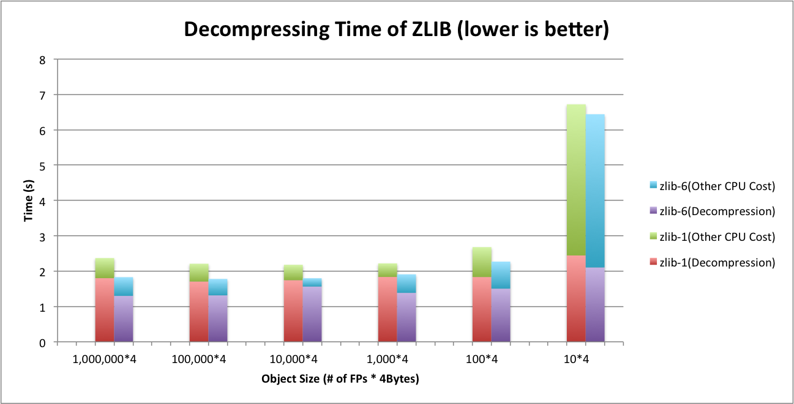
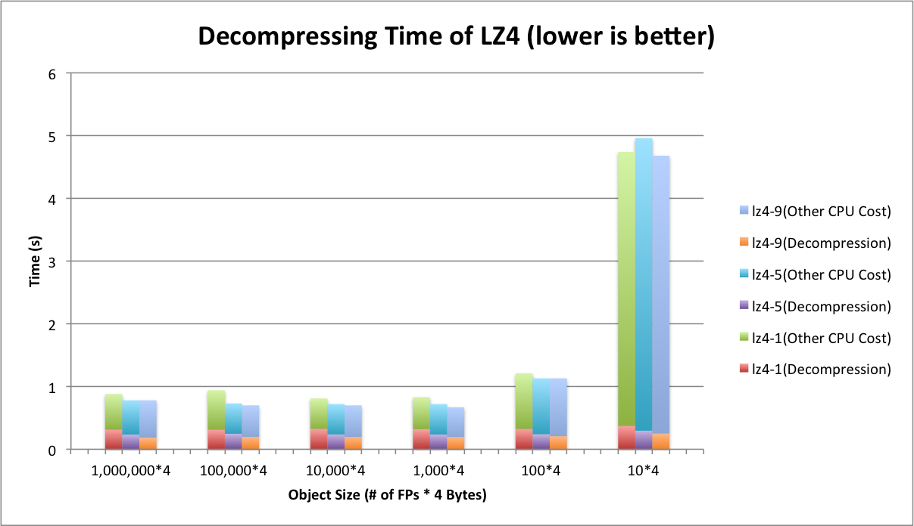

Title: Exploring Compression Techniques of ROOT IO
Date: 2017-03-22 10:00
Slug: project_root_io_compression.html
Authors: Zhe Zhang
Summary: ROOT IO Compression Project

ROOT provides an flexible format used throughout the HEP community. The number of use cases - from an archival data format to end-stage analysis - has required a number of tradeoffs to be exposed to the user. For example, a high compression level in the traditional DEFLATE algorithm will result in a smaller file (saving disk space) at the cost of slower decompression (costing CPU time when read). At the scale of the LHC experiment, poor design choices can result in terabytes of wasted space or wasted CPU time. We explore and attempt to quantify some of these tradeoffs.
Specifically, we explore: 

1. The use of alternate compressing algorithms to optimize for read performance;
2. An alternate method of compression individual events to allow efficient random access;
3. A new approach to whole-file compression. 

### ZLIB vs. LZMA vs. LZ4

The following table compares various metrics among ZLIB, LZMA and LZ4 libraries. As seen in the table, LZ4 decompression speeds are of 10 to 100 magnitudes faster than ZLIB and LZMA. LZMA, on the other hand, provides high compression ratios and shows a strong candidancy for archival applications.

<table class="tg" align="center">
  <tr>
    <th class="tg-hgcj">Algorithms</th>
    <th class="tg-amwm">Compression Time (s)</th>
    <th class="tg-amwm">Decompression Time (s)</th>
    <th class="tg-amwm">Compressed File Size (GB)</th>
    <th class="tg-amwm">Compression Ratio</th>
  </tr>
  <tr>
    <td class="tg-baqh">ROOT(ZLIB-6)</td>
    <td class="tg-baqh">228.67</td>
    <td class="tg-baqh">18.45</td>
    <td class="tg-baqh">1.54</td>
    <td class="tg-baqh">4.14</td>
  </tr>
  <tr>
    <td class="tg-baqh">ZLIB-1</td>
    <td class="tg-baqh">86.47</td>
    <td class="tg-baqh">21.51</td>
    <td class="tg-baqh">1.79</td>
    <td class="tg-baqh">3.58</td>
  </tr>
  <tr>
    <td class="tg-baqh">ZLIB-5</td>
    <td class="tg-baqh">159.84</td>
    <td class="tg-baqh">19.20</td>
    <td class="tg-baqh">1.58</td>
    <td class="tg-baqh">4.03</td>
  </tr>
  <tr>
    <td class="tg-baqh">ZLIB-9</td>
    <td class="tg-baqh">1715.25</td>
    <td class="tg-baqh">18.28</td>
    <td class="tg-baqh">1.49</td>
    <td class="tg-baqh">4.27</td>
  </tr>
  <tr>
    <td class="tg-baqh">LZ4</td>
    <td class="tg-baqh">11.26</td>
    <td class="tg-baqh">2.97</td>
    <td class="tg-baqh">2.17</td>
    <td class="tg-baqh">2.94</td>
  </tr>
  <tr>
    <td class="tg-baqh">LZ4HC-5</td>
    <td class="tg-baqh">95.13</td>
    <td class="tg-baqh">2.81</td>
    <td class="tg-baqh">1.75</td>
    <td class="tg-baqh">3.76</td>
  </tr>
  <tr>
    <td class="tg-baqh">LZ4HC-9</td>
    <td class="tg-baqh">275.31</td>
    <td class="tg-baqh">2.54</td>
    <td class="tg-baqh">1.66</td>
    <td class="tg-baqh">3.85</td>
  </tr>
  <tr>
    <td class="tg-baqh">LZMA-1</td>
    <td class="tg-baqh">823.84</td>
    <td class="tg-baqh">230.64</td>
    <td class="tg-baqh">1.35</td>
    <td class="tg-baqh">4.72</td>
  </tr>
  <tr>
    <td class="tg-baqh">LZMA-5</td>
    <td class="tg-baqh">3318.35</td>
    <td class="tg-baqh">211.71</td>
    <td class="tg-baqh">1.23</td>
    <td class="tg-baqh">5.17</td>
  </tr>
  <tr>
    <td class="tg-baqh">LZMA-9</td>
    <td class="tg-baqh">4969.20</td>
    <td class="tg-baqh">212.47</td>
    <td class="tg-baqh">1.21</td>
    <td class="tg-baqh">5.27</td>
  </tr>
</table>

### Comparison between ZLIB and LZ4 on Sythetically Generated Files

We compare two compression algorithms - ZLIB and LZ4 - on ROOT files. We evaluate performance in three metrics: compressing time, decompressing time and compression ratio. In addition, we test how much the compression layer contributes to the total CPU cycles in ROOT.

#### *Test Setup*

We create a class called TDummy in which there are two attribute: fSize and fDummy. fDummy is a array containing fSize number of floating points(FPs). We fill in every byte of the array with ASCII characters ‘a’, ‘b’, ‘c’, ‘d’ following a particular distribution pattern (‘a’: 65%, ‘b’: 25%, ‘c’: 5%, ‘d’: 5%). fSize is a 4-byte integer that define the size of the array.
We generate various object ranging 40 Bytes to 4 MB by tuning fSize of the array. Let’s take 40 B as an example, we set fSize as 10, and fDummy contains 10 FPs, each of which is 4 bytes. Therefore, each object of TDummy is around 40 B (fSize also contributes 4 bytes to the object but this is negligible as fDummy becomes large). Similarly, 4 MB of object has fSize configured as 1,000,000.
In order to conduct a fair experiment, we try to generate the same amount of FPs while we use different object size to fill in baskets. For example, with 40 B of object, we generate 10,000,000 objects. In other words, 400 MB of FPs are generated and stored in a ROOT file. For the case that each object is 4 MB, we only generate 100 objects and the total size of FPs should be the same as before. However, due to the design of ROOT, there is some extra meta-information also needs to be stored in a file. To some degree, meta-information depends objects. Therefore, smaller objects should generate more meta-information. As a result, actual file sizes storing different objects could turn out to be very different even though they contain the same amount of dummy FP data.

#### *Basket Distribution in the Generated File*

In order to characterize meta-information in the ROOT file, we separate fDummy array from other branches. Figure 1 shows the distribution of number of baskets in different branches. Figure 2 shows the distribution of branch sizes. To give a intuitive view of basket sizes, we divide total sizes by the number of baskets and shows the average of basket size in the Figure 3. As seen in Figure 1, Figure 2 and Figure 3, the basket size reaches the minimum 58 KB at object size of 4 KB.  The meta-information dramatically increases when object size goes below 4 KB.

  
   <b>Figure 1. Basket Distribution in the Generated File</b> 

  
   <b>Figure 2. Branch Sizes in the Generated File</b> 

  
   <b>Figure 3. Average Basket Sizes in the Generated File</b> 

#### *Compressing Time*

Figure 4 illustrates the compressing time of different algorithms. ZLIB and LZ4 interleave with each other at different compression levels. LZ4-9 is the slowest and then in decreasing order followed by ZLIB-6, LZ4-5, ZLIB-1 and LZ-1.

  
   <b>Figure 4. Compressing Time on the Generated File</b> 

#### *Decompressing Time*

Figure 5 shows the decompressing time of ZLIB and LZ4 on the generated file. Unlike compressing time, LZ4’s decompression speed outperforms ZLIB at all levels. Based on our measurement, the decompression speed of LZ4 is generally 4~7 times faster than ZLIB. As the object size goes to 40 B, there is a sudden jump on the decompressing time. We analyze the case in the next section.

  
   <b>Figure 5. Decompressing Time on the Generated File</b> 

#### *Sensitivity of Event Size on Decompressing Time*

To demonstrate what happens on tiny object cases, we zoom in Figure 5 and take a closer look at two compressors. Figure 6 and Figure 7 show the decompressing time of ZLIB and LZ4 respectively. In addition, we plot the total CPU cycles consumed during decompressing the file. As seen in Figure 6, ZLIB’s decompression occupies relatively 2/3 of the total CPU cycles. Other 1/3 of CPU cycles are contributed but not limited by deserialization. Unlike ZLIB, LZ4 shown in Figure 7 relax the CPU a little bit and contributes to 1/4 of total cycles.
When we deal with tiny objects (40 B in Figure 6 and Figure 7), both ZLIB and LZ4 have a slight increase on decompression part like bold lines shown in Figure 6 and Figure 7. However, comparing to deserialization, this change does not have significant impact. Deserialization starts stressing out CPU quickly in this case.

  
   <b>Figure 6. Decompressing Time of ZLIB</b> 

  
   <b>Figure 7. Decompressing Time of LZ4</b> 

#### *Compression Ratio*

Faster decompression speed comes with a downside that LZ4 gains less compression ratios than ZLIB. Figure 8 shows compression factors (compression ratios). For each algorithm, higher level produce higher compression ratio. LZ4 is not as storage efficient as ZLIB. LZ4 gets less compression ratios at all levels comparing to ZLIB.

  
   <b>Figure 8. Compressing Ratios on the Generated File</b> 

#### *Conclusions about ZLIB and LZ4*

In general, LZ4 is paying for decompression speed at the expense of storage space. Figure 9 shows the tradeoffs of different compression schemes. LZ4 allows decompression speed at 4~7 times faster than ZLIB while sufferring more storage cost.

  
   <b>Figure 9. Tradeoff between Decompressing Time and Compression Ratio</b> 

Additionally, the compressing time are mixed by different levels of two compressors. The general rule is LZ4-9 > ZLIB-6 > LZ4-5 > ZLIB-1 > LZ4-1.

### Random Access Compression (RAC)

By default, ROOT requires all objects in the buffer to be decompressed at once; we introduce RAC, compressing each event within the buffer individually. There are two downsides of RAC: poor compression ratio (since the compressor cannot reference bytes in a prior event) and the overhead added to TBasket required to track each event. In order to keep track of access points of different events in compressed basket, we add an array in TBasket and store offsets of all the events in compressed buffer. When reading a particular event, this technique allows us to find the access point where the event is located within TBasket and start decompressing right from there.

We create some dummy events to simulate typical cases. We create three types of event: TInt, TSmall and TLarge. TInt is a tiny event consisting of 6 integers with the same value. Each TSmall contains 1000 Floating Points(FPs). To construct a TSmall, we first randomly generate a FP and then repeat this value 6 times. We start over the same process until all 1,000 FPs are filled. TLarge is generated in the same way but contains 1,000,000 FPs. Each event of TInt, TSmall and TLarge is 39 bytes, 4KB and 4MB respectively.

#### *Compression Ratio and Compressing Time*

Figure 10 shows the compression ratios and write performance of RAC. As seen in Figure 10, RAC has a bad impact on the write performance when TBaskets are filled with very small events. In addition, RAC needs more time to compress the data.

  
   <b>Figure 10. Compression Ratio and Compressing Performance of RAC</b> 

#### *Random Read Performance*

As Figure 11 shows, performance of reading small events is boosted with RAC because it only needs to decompress very small portion of the basket. Instead, ZLIB without RAC has to decompress the whole basket before reading the event.

  
   <b>Figure 11. Random Read Performance of RAC</b> 

#### *Sequential Read Performance*

In Figure 12, TSmall events have significant improvement if we use RAC. It is because the RAC saves time on decompression. However, TInt events do not have too much improvement with RAC. Compressing individual TInt event significantly loses compression ratio, therefore the bottleneck of the program starts shifting from CPU-bounded to IO-bounded.

  
   <b>Figure 12. Sequential Read Performance of RAC</b> 

### SquashFS v.s ROOT

We compare the performance of External Compression - compressing the file with a separate program outside ROOT. In External Compression, we blindly divide ROOT files into smaller blocks of the same size and compress each individually. We use SquashFS to test this approach.  Importantly, it presents the file as a mounted filesystem - entries in the page cache are uncompressed buffers.

There are two purposes of doing external compression. First, we want to give a quantitative comparison of how well ROOT formats the raw data. Second, we want to verify if user-space compression is efficient.

#### *Compression Ratios*

Figure 13 illustrates compression ratios of SquashFS with different block sizes ranging between 4 KB to 1 MB. As the block size increases, compression ratio is improved. With the block sizes between 4KB and 16KB, ROOT has better compression ratios than SquashFS. When the block size goes beyond 16KB, their compression ratios become very close to each other. The result proves that ROOT organizes the data better than SqushFS.

  
   <b>Figure 13. Compression Ratios of SquashFS</b> 

#### *Disk-to-Buffer Size*

In order to get into more depth of the variance, we test three different reading workloads. The first workload is sequentially reading all events. The second is reading every 10th events. The third workload reads every 100th events. The purpose of this experiment is to simulate the sparse reads. We believe sparsely scanning the events can mitigate the cache effects. Figure 14, Figure 15 and Figure 16 show the results of three workloads. Particularly, as can be seen in Figure 15 of reading every 10th and 100th of events, SqushFS needs to fetch more data from disk in order to read the events since it does not know the data layout. One example could be an event is located across the boundary of two SquashFS blocks and reading this event requires to load two blocks from disk to the buffer.

  
   <b>Figure 14. Sequential Read Size from Cold Cache of SquashFS</b> 

  
   <b>Figure 15. 10% Read Size from Cold Cache of SquashFS</b> 

  
   <b>Figure 16. 1% Read Size from Cold Cache of SquashFS</b> 

#### *Time of Reading Events*

Figure 17, Figure 18 and Figure 19 show the results of running the same reading workloads. We examine the reading time and all tests have been running with hot cache. For the workload of reading every 10th of events, SqushFS and ROOT goes to the opposite trends as the block size gets larger. For SquashFS, the larger block can reduce the chance of loading multiple blocks for a single event. As a result, it takes less time to read the events. ROOT only reads the minimum number of baskets. However, as each of the baskets becomes larger, it has to spend more time on decompressing the data.

The result becomes more interesting when we read every 100th of events. Since SquashFS decompresses data in kernel space, with hot cache all requested events appear to be uncompressed in the memory. So increasing block size does not have any impact on reading time. In contrast, ROOT decompresses the data in user space. As a result, the reading time still increasing with larger blocks.

  
   <b>Figure 17. Sequential Read Time from Hot Cache of SquashFS</b> 

  
   <b>Figure 18. 10% Read Time from Hot Cache of SquashFS</b> 

  
   <b>Figure 19. 1% Read Time from Hot Cache of SquashFS</b> 

